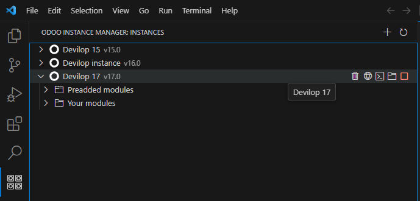

# Odoo Instance Manager
Odoo Instance Manager is a extension that provides in a easily way the capacity for install the different versions of the Odoo ERP for the developer with the objective of speed up the development of a module for different Odoo versions.

## Requirements
**This extension use Docker** in the background for the instance management, then if you hasn't installed follow the [**official guide**](https://docs.docker.com/get-docker/) for your system.

## Overview
In the future i will make a video showing all the features better. But for the moment i will put some image and explain a bit.
All the functionality is on the view container Odoo Instance Manager and the item in the Status bar, the item will control
the status of the PostgreSQL container required for Odoo.

At the moment the extension don't expose any special API except the default activate and desactivate. Because of this, there is no technical docs in the repo.

## Features
* Fast management for PostgreSQL container
* Create a instance of Odoo 15, 16 or 17
* Delete a created instance
* Add addons to instances
* Open instance in browser
* Open a shell for advanced module installation
* List modulest preinstalled and added by you